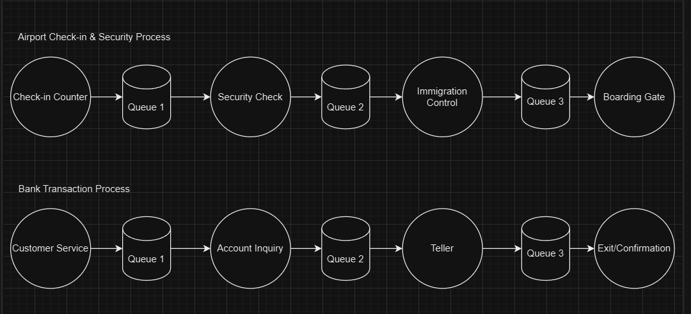

1.4 - Task 03

### Airport Check-in & Security Process
Check-in Counter – Passengers check in, drop off baggage, and receive boarding passes.
Queue 1 - A queue forms as passengers wait to be assisted by airline staff for check-in. Peak times can lead to longer queues.
Security Check – Passengers go through security screening.
Queue 2 - Passengers line up for security screening, which may involve multiple lines for different levels of screening.
Immigration Control – Passports are checked for international travelers.
Queue 3 -  For international flights, there may be a queue to get through immigration.
Boarding Gate – Final boarding verification before getting on the plane.

### Bank Transaction Process
Customer Service (Service Point 1) – The customer enters and is greeted by a service representative who directs them to the correct counter.
Queue 1 - Customers may wait in line at the entrance to get assistance or be directed to the appropriate service counter.
Account Inquiry/Services (Service Point 2) – The customer either speaks with an agent or uses a kiosk to inquire about their account balance, loans, or other services.
Queue 2 - There could be a queue for speaking with agents at the counter depending on availability.
Teller (Service Point 3) – The customer completes a transaction such as depositing money, withdrawing funds, or transferring funds.
Queue 3 - Customers typically line up at the tellers for financial transactions.
Exit/Confirmation (Service Point 4) – The customer receives a receipt and exits the bank.
